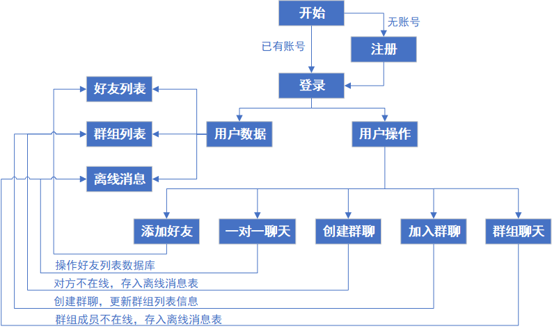

# TinyChatServer
 > 💡 **A tiny clustered chatserver based on  the Muduo  network library**
### 项目概述
- 基于Muduo网络库实现的集群聊天服务器
### 开发环境
- ubuntu 20.04
- g++ 9.4.0
- CMake 3.16.3
- [Muduo 2.0.2](https://github.com/chenshuo/muduo)
- MySQL 8.0.29
- Redis 5.0.7
- Nginx 1.18.0
### 技术要点
- 使用muduo网络库作为项目网络核心模块，提供给高并发网络IO服务，解耦网络和业务模块代码
- 使用json序列反序列化消息作为私有通信协议
- 使用MySQL关系型数据库为项目数据提供落地存储
- 使用Redis消息队列作为服务器中间件，基于其发布订阅功能实现跨服务器的消息通信
- 配置Nginx基于tcp的负载均衡，实现聊天服务器的集群功能，提高后端服务的并发能力
### 业务流程
- [业务流程总结](./TinyChatServer/notes/%E6%80%BB%E7%BB%93.md)(更新中......)

### 使用方法
~~~
git clone git@github.com:jtwhu/TinyChatServer.git
cd TinyChatSerer
sh autobuild.sh
~~~
### 后续改进
- [ ] 使用数据库连接池提高数据库存取性能
### 项目总结
- coming soon......
### 参考资料
- [1] 施磊．集群聊天服务器．图论科技.2020.7．