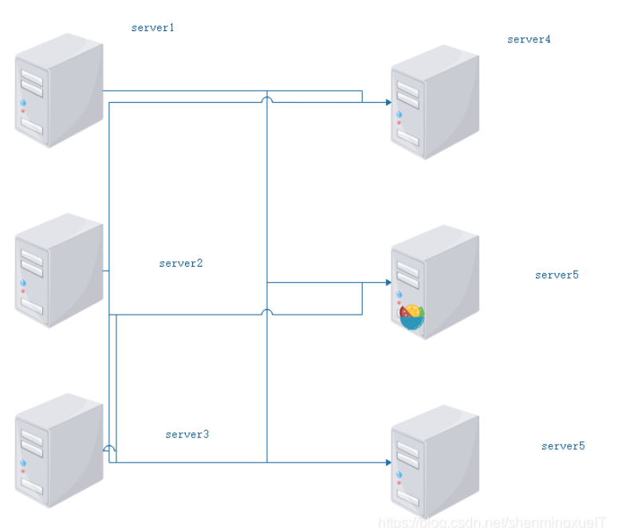
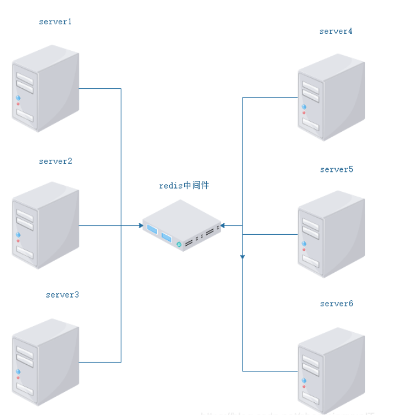

## 业务概述
- 基于Muduo网络库实现一个仿QQ的集群聊天服务器。
- 提供注册、登录、添加好友、一对一聊天、添加群聊、创建群聊、加入群聊、群组聊天、群成员信息查询、离线接收消息等功能。
## 业务流程
- 详细业务流程如下：

## 项目架构
- 整个项目采用MVC架构，拆分为三个部分:客户端、服务端、数据库，使用业务逻辑、数据以及界面显示分离的方式组织代码。
### 客户端

### 服务器 
#### 网络模块
- 网络模块中没有使用socket+epoll去造轮子，而是直接使用muduo库提供的接口。
- 使用muduo网络库具备以下优点：
  - 接口简单，方便使用
  - one loop per thread的设计模型
  - muduo库底层封装了线程池
> - one loop per thread:
>   - muduo库采用的reactor模型，有点像Nginx的负载均衡，但是也有差别，nginx采用的是多进程，muduo采用的是多线程
>   - 在muduo库设计中，有一个main reactor负责接收客户端的连接，然后使用轮询的方式给sub reactor分配连接，而客户端的读写事件都在sub reactor线程上进行。（类似于Nginx的IO进程+工作进程的组合）

muduo库中提供了两个非常重要的注册回调接口：**连接回调**与**消息回调**
~~~C++
\#include <iostream>
using namespace placeholders;

//注册连接回调
server_.setConnectionCallback(bind(&ChatServer::on_connection, this, _1));

//注册消息回调
server_.setMessageCallback(bind(&ChatServer::on_message, this, _1, _2, _3));

~~~
设置处理有关**连接事件**的方法回调和处理**读写事件**的方法回调
~~~C++
// 上报连接相关信息的回调函数
void on_connection(const TcpConnectionPtr&);

// 上报读写事件相关信息的回调函数
void on_message(const TcpConnectionPtr &, Buffer *, Timestamp);
~~~
- 当用户进行连接或者断开连接时使用on_connection方法进行处理，其执行对象应该是**main reactor**
- 发生读写事件时，会调用on_message方法，执行对象为**sub reactor**, 其内容与网络模块和业务模块
#### 网络模块与业务模块的解耦
在通信模块中，字段msgid记载了服务器与客户端通信的消息类型，其值是一个枚举类型，如下所示：
~~~C++
enum EnMsgType{
    LOGIN_MSG = 1,// 登录消息
    LOGIN_MSG_ACK,// 登录响应消息
    LOGINOUT_MSG,// 注销消息
    REG_MSG,// 注册消息
    REG_MSG_ACK,// 注册响应消息
    ONE_CHAT_MSG,// 一对一聊天消息
    ADD_FRIEND_MSG,// 添加好友消息

    CREATE_GROUP_MSG,// 创建群组
    ADD_GROUP_MSG,// 加入群组
    GROUP_CHAT_MSG// 群聊天
};
~~~
在业务模块中添加一个无序关联容器unordered_map,键为消息类型，值为发生不同类型事件对应的处理回调。
~~~C++
// 用户基本业务管理相关事件处理回调注册
_msgHandlerMap.insert({LOGIN_MSG, std::bind(&ChatService::Login,this, _1, _2, _3)});// 绑定消息与对应的事件处理器
_msgHandlerMap.insert({LOGINOUT_MSG, std::bind(ChatService::LoginOut, this, _1, _2, _3)});
_msgHandlerMap.insert({REG_MSG, std::bind(&ChatService::Reg,this, _1, _2, _3)});
_msgHandlerMap.insert({ONE_CHAT_MSG, std::bind(ChatService::OneChat, this, _1, _2, _3)});
_msgHandlerMap.insert({ADD_FRIEND_MSG, std::bind(ChatService::AddFriend, this, _1, _2, _3)});

// 群组业务管理相关事件处理回调注册
_msgHandlerMap.insert({CREATE_GROUP_MSG, std::bind(ChatService::CreateGroup, this, _1, _2, _3)});
_msgHandlerMap.insert({ADD_GROUP_MSG, std::bind(ChatService::AddGroup, this, _1, _2, _3)});
_msgHandlerMap.insert({GROUP_CHAT_MSG, std::bind(ChatService::GroupChat, this, _1, _2, _3)});
~~~
由此得到一个存储了消息类型以及处理这个消息的方法的容器。
因此在**网络层**就可以根据消息类型来获得并执行其handler。
这种方式就**避免了使用条件分支语句直接在网络层修改代码**，实现了网络层与业务层代码的解耦。
- 解耦的好处：
  - 方便代码改动：增加新业务时无需更改网络层代码
  - 网络层只需要传入msg_id就可以获得对应的业务handler回调，从而执行相关的业务逻辑
  - 业务层与网络层代码解耦，开发时只需要专注于当前模块的逻辑，不需要考虑模块之间的交互
~~~C++
// 解耦网络模块与业务模块的代码
// 通过[message id]获取业务handler, connection , js, time
auto msg_handler = ChatService::Instance()->GetHandler(js["msgid"get<int>());
// 回调消息绑定好的事件处理器，来执行相应的业务处理
msg_handler(conn, js, time);
~~~
#### 业务模块
经过以上步骤，**网络模块**代码与**业务模块**代码实现解耦，可以专注于业务模块的开发，无需关注网络层中的代码。
业务模块内部维护了以下的对象和方法，通过以下对象和方法就可以实现
只需要操作对象，无需关注底层的功能实现
~~~C++
//================业务模块（chatservice）内部对象===================

    // 数据操作类对象
    UserModel _userModel;
    // redis操作对象
    Redis _redis;
    // 消息处理器表，存储消息ID及其对应的处理操作
    unordered_map<int, MsgHandler> _msgHandlerMap;
    // 存储在线用户的通信连接
    unordered_map<int, TcpConnectionPtr> _userConnMap;
    // 定义互斥锁，保证_userConnMap的线程安全
    mutex _connMutex;
    // 离线消息表
    OfflineMsgModel _offlineMsgModel;
    // 好友列表
    FriendModel _friendModel;
    // 群组列表
    GroupModel _groupModel;

//================业务模块（chatservice）内部函数===================

   // 获取单例对象的接口函数
    static ChatService* Instance();
    // 处理登录业务
    void Login(const TcpConnectionPtr &conn, json &js, Timestamp time);
    // 处理注册业务
    void Reg(const TcpConnectionPtr &conn, json &js, Timestamp time);
    // 一对一聊天业务
    void OneChat(const TcpConnectionPtr &conn, json &js, Timestamp time);
    // 添加好友业务
    void AddFriend(const TcpConnectionPtr &conn, json &js, Timestamp time);
    // 创建群组业务
    void CreateGroup(const TcpConnectionPtr &conn, json &js, Timestamp time);
    // 加入群组业务
    void AddGroup(const TcpConnectionPtr &conn, json &js, Timestamp time);
    // 群组聊天业务
    void GroupChat(const TcpConnectionPtr &conn, json &js, Timestamp time);
    // 处理注销业务
    void LoginOut(const TcpConnectionPtr &conn, json &js, Timestamp time);
    // 处理客户端异常退出
    void ClientCloseException(const TcpConnectionPtr &conn);
    // 服务器异常，业务重置方法
    void Reset();
    // 获取消息对应的处理器
    MsgHandler GetHandler(int msgid);
    // 获取redis消息队列中订阅的消息(channel对应于userid)
    void HandleRedisSubscribeMessage(int channel, string msg);

~~~
##### 注册业务
服务器接收到json字符串，将其反序列化得到待注册的信息，然后写入到user表中，注册成功则将`id`号码返回,注册失败则将errno字段设置为1。
~~~C++
     string name = js["name"];
     string pwd  = js["password"];

     // 生成新用户
     User user;
     user.SetName(name);
     user.SetPwd(pwd);

     // 插入新用户
     bool state = _userModel.Insert(user);// 如果是新用户，可以插入成功，如果不是则无法插入

     if(state){
         // 注册成功
         json response;
         response["msgid"] = REG_MSG_ACK;
         response["errno"] = 0;// errno为0表示注册成功
         response["id"] = user.GetId();
         conn->send(response.dump());
     }else{
         // 注册失败
         json response;
         response["msgid"] = REG_MSG_ACK;
         response["errno"] = 1;// errno为1表示注册失败
         conn->send(response.dump());
     }
~~~
##### 登录业务
服务器接收到json字符串，并将其反序列化，得到用户发送的账号以及密码信息。
首先就是检测这个账号和密码是否与服务器中的数据匹配，如果不匹配则把errno设置为1，并返回id or password的错误信息。
- 检查用户账号是否已经存在
~~~C++
 User user = _userModel.Query(id);
~~~
- 用户账号存在并且状态为离线，登录成功
  - 更新用户连接信息
  ~~~C++
  // 注意用户连接表是多线程访问的，因此需要保证其线程的安全性
  {// 记录用户连接信息，小技巧：使用局部作用域让锁自动释放
      lock_guard<mutex> lock(_connMutex);
      _userConnMap.insert({id, conn});
  }// 访问数据之前加锁，出作用域自动解锁
  ~~~
  - 更新用户在线信息
  - 查询用户离线消息
  - 查询用户好友信息
  - 查询用户群组信息
##### 添加好友业务
通过业务模块内部维护的friendmodel维护好友列表，并通过该对象操作底层数据
~~~C++
    // 将json字符串反序列化
    int userid = js["id"].get<int>();
    int friendid = js["friendid"].get<int>();

    // 存储好友信息
    _friendModel.Insert(userid, friendid);// 用户id和friendid
~~~
##### 一对一聊天业务
~~~C++
~~~
##### 加入群聊业务
##### 群组聊天业务
##### 注销业务

#### 服务器集群
一般来说，一台服务器只支持1-2的并发量，但这是远远不够的，我们需要更高的并发量支持，这个时候就需要引入**Nginx tcp长连接负载均衡算法**。（为什么是长连接？因为聊天通信需要保持长连接）
当一个新的客户端发送连接请求，负责均衡模块会根据我们在nginx.conf中设置的参数来分配服务器资源。
Nginx负载均衡器的作用：
- 统一接收来自客户端的请求，使用负载算法将客户端的请求分发到对应的服务器中
- 和ChatServer保持**心跳机制**，检测chatserver故障
- 发现新添加的chatserver设备，方便扩展服务器数量

当引入服务器集群的概念之后，自然而然的就衍生出下一个问题，注册在不同的ChatServer上的用户如何跨服务器进行通信？
#### 跨服务器通信
跨服务器通信方法：使用**redis消息队列**作为**中间件**实现跨服务器通信
先来看一下，如果不使用中间件如何实现跨服务器通信。为了实现跨服务器通信，需要两两之间建立连接，也就是C~N~^2^。
- 如果服务器数量众多，建立的连接数量也响应增多，显然是十分不方便的
- 此外，如果田间新的服务器，每一台服务器都要与原有的所有服务器建立连接，十分繁琐

- 但是如果使用中间件作为通信介质，只需要建立建立N条链接即可
- 增加新的服务器时，也只需要每一台新增的服务器添加一条连接即可

### 数据库
#### 表单设计
对业务层面涉及到的数据进行抽象，设计以下表单存储用户数据
- **用户列表**
  记录用户信息：姓名、密码、状态（离线or在线）
  
- **好友列表**
  记录好友信息，其中userid与friendid为联合主键
  
- **离线消息列表**
  记录离线消息，当用户登录时，与服务器建立连接，查询是否存在离线消息，有则取回离线消息
  
- **群组列表**
  记录群组列表，包括群组id,群组名称以及群组描述三个字段
  
- **群组成员列表**
  记录群组成员，包括群组id，userid以及grouprole（群主、群成员）
  
#### 