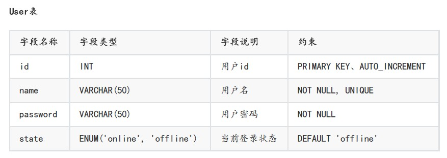
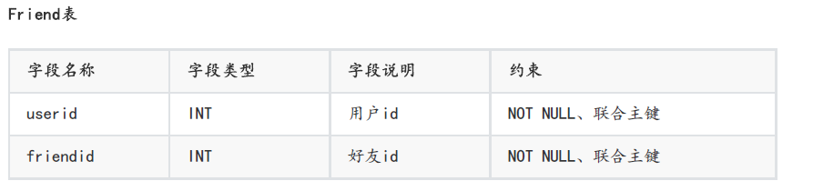
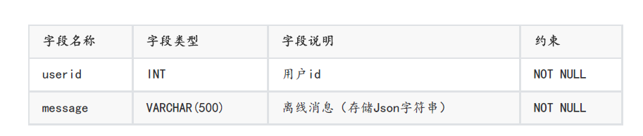
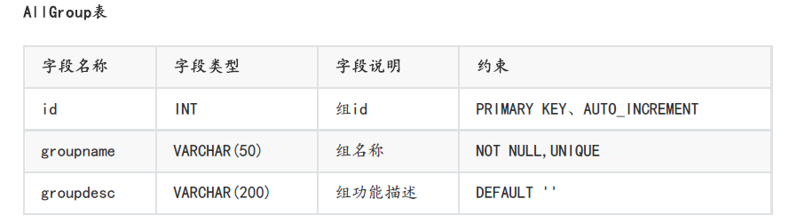
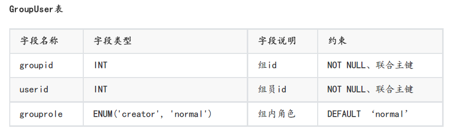

## 业务概述
- 基于Muduo网络库实现一个仿QQ的集群聊天服务器。
- 提供注册、登录、添加好友、一对一聊天、添加群聊、创建群聊、加入群聊、群组聊天、群成员信息查询、离线接收消息等功能。
## 业务流程
- 详细业务流程如下：

## 项目架构
- 整个项目采用MVC架构，拆分为三个部分:客户端、服务端、数据库，使用业务逻辑、数据以及界面显示分离的方式组织代码。
### 客户端

### 服务器 
#### 网络模块
- 网络模块中没有使用socket+epoll去造轮子，而是直接使用muduo库提供的接口。
- 使用muduo网络库具备以下优点：
  - 接口简单，方便使用
  - one loop per thread的设计模型
  - muduo库底层封装了线程池
> - one loop per thread:
>   - muduo库采用的reactor模型，有点像Nginx的负载均衡，但是也有差别，nginx采用的是多进程，muduo采用的是多线程
>   - 在muduo库设计中，有一个main reactor负责接收客户端的连接，然后使用轮询的方式给sub reactor分配连接，而客户端的读写事件都在sub reactor线程上进行。（类似于Nginx的IO进程+工作进程的组合）

muduo库中提供了两个非常重要的注册回调接口：**连接回调**与**消息回调**
~~~C++
\#include <iostream>
using namespace placeholders;

//注册连接回调
server_.setConnectionCallback(bind(&ChatServer::on_connection, this, _1));

//注册消息回调
server_.setMessageCallback(bind(&ChatServer::on_message, this, _1, _2, _3));

~~~
设置处理有关**连接事件**的方法回调和处理**读写事件**的方法回调
~~~C++
// 上报连接相关信息的回调函数
void on_connection(const TcpConnectionPtr&);

// 上报读写事件相关信息的回调函数
void on_message(const TcpConnectionPtr &, Buffer *, Timestamp);
~~~
- 当用户进行连接或者断开连接时使用on_connection方法进行处理，其执行对象应该是**main reactor**
- 发生读写事件时，会调用on_message方法，执行对象为**sub reactor**, 其内容与网络模块和业务模块
#### 网络模块与业务模块的解耦
在通信模块中，字段msgid记载了服务器与客户端通信的消息类型，其值是一个枚举类型，如下所示：
~~~C++
enum EnMsgType{
    LOGIN_MSG = 1,// 登录消息
    LOGIN_MSG_ACK,// 登录响应消息
    LOGINOUT_MSG,// 注销消息
    REG_MSG,// 注册消息
    REG_MSG_ACK,// 注册响应消息
    ONE_CHAT_MSG,// 一对一聊天消息
    ADD_FRIEND_MSG,// 添加好友消息

    CREATE_GROUP_MSG,// 创建群组
    ADD_GROUP_MSG,// 加入群组
    GROUP_CHAT_MSG// 群聊天
};
~~~
在业务模块中添加一个无序关联容器unordered_map,键为消息类型，值为发生不同类型事件对应的处理回调。
~~~C++
// 用户基本业务管理相关事件处理回调注册
_msgHandlerMap.insert({LOGIN_MSG, std::bind(&ChatService::Login,this, _1, _2, _3)});// 绑定消息与对应的事件处理器
_msgHandlerMap.insert({LOGINOUT_MSG, std::bind(ChatService::LoginOut, this, _1, _2, _3)});
_msgHandlerMap.insert({REG_MSG, std::bind(&ChatService::Reg,this, _1, _2, _3)});
_msgHandlerMap.insert({ONE_CHAT_MSG, std::bind(ChatService::OneChat, this, _1, _2, _3)});
_msgHandlerMap.insert({ADD_FRIEND_MSG, std::bind(ChatService::AddFriend, this, _1, _2, _3)});

// 群组业务管理相关事件处理回调注册
_msgHandlerMap.insert({CREATE_GROUP_MSG, std::bind(ChatService::CreateGroup, this, _1, _2, _3)});
_msgHandlerMap.insert({ADD_GROUP_MSG, std::bind(ChatService::AddGroup, this, _1, _2, _3)});
_msgHandlerMap.insert({GROUP_CHAT_MSG, std::bind(ChatService::GroupChat, this, _1, _2, _3)});
~~~
由此得到一个存储了消息类型以及处理这个消息的方法的容器。
因此在**网络层**就可以根据消息类型来获得并执行其handler。
这种方式就**避免了使用条件分支语句直接在网络层修改代码**，实现了网络层与业务层代码的解耦。
- 解耦的好处：
  - 方便代码改动：增加新业务时无需更改网络层代码
  - 网络层只需要传入msg_id就可以获得对应的业务handler回调，从而执行相关的业务逻辑
  - 业务层与网络层代码解耦，开发时只需要专注于当前模块的逻辑，不需要考虑模块之间的交互
~~~C++
// 解耦网络模块与业务模块的代码
// 通过[message id]获取业务handler, connection , js, time
auto msg_handler = ChatService::Instance()->GetHandler(js["msgid"get<int>());
// 回调消息绑定好的事件处理器，来执行相应的业务处理
msg_handler(conn, js, time);
~~~
#### 业务模块
经过以上步骤，**网络模块**代码与**业务模块**代码实现解耦，可以专注于业务模块的开发，无需关注网络层中的代码。
##### 注册业务
##### 登录业务
##### 添加好友业务
##### 一对一聊天业务
##### 加入群聊业务
##### 群组聊天业务
##### 注销业务

#### 跨服务器通信
### 数据库
#### 表单设计
对业务层面涉及到的数据进行抽象，设计以下表单存储用户数据
- **用户列表**
  记录用户信息：姓名、密码、状态（离线or在线）
  
- **好友列表**
  记录好友信息，其中userid与friendid为联合主键
  
- **离线消息列表**
  记录离线消息，当用户登录时，与服务器建立连接，查询是否存在离线消息，有则取回离线消息
  
- **群组列表**
  记录群组列表，包括群组id,群组名称以及群组描述三个字段
  
- **群组成员列表**
  记录群组成员，包括群组id，userid以及grouprole（群主、群成员）
  
#### 